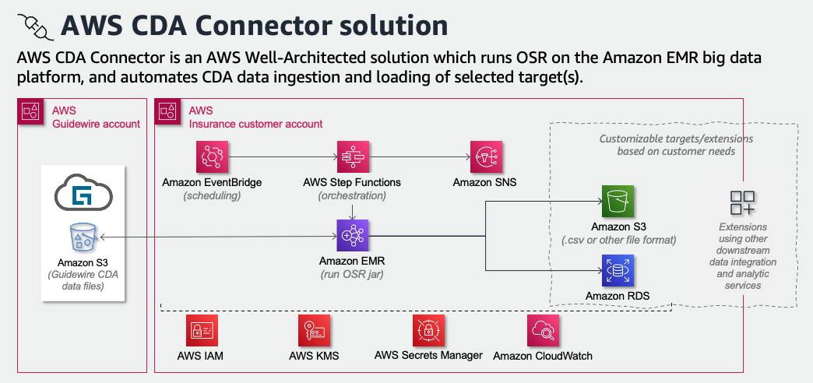
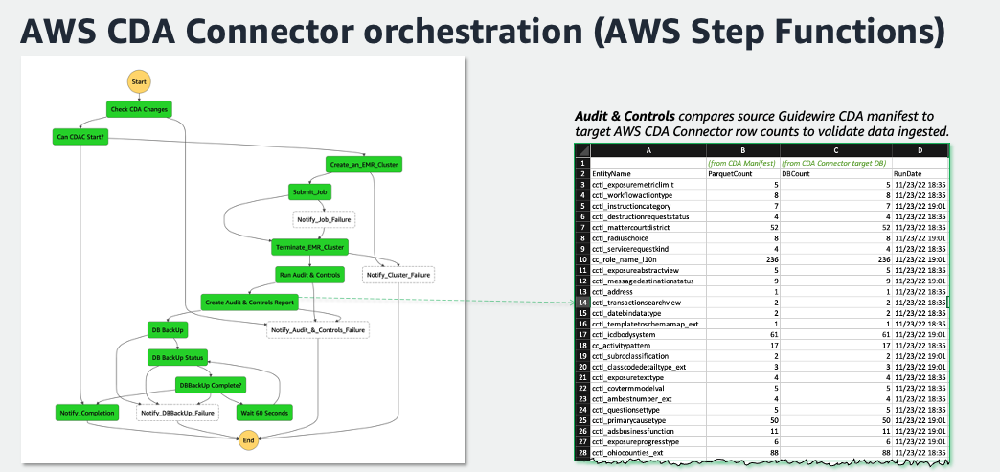
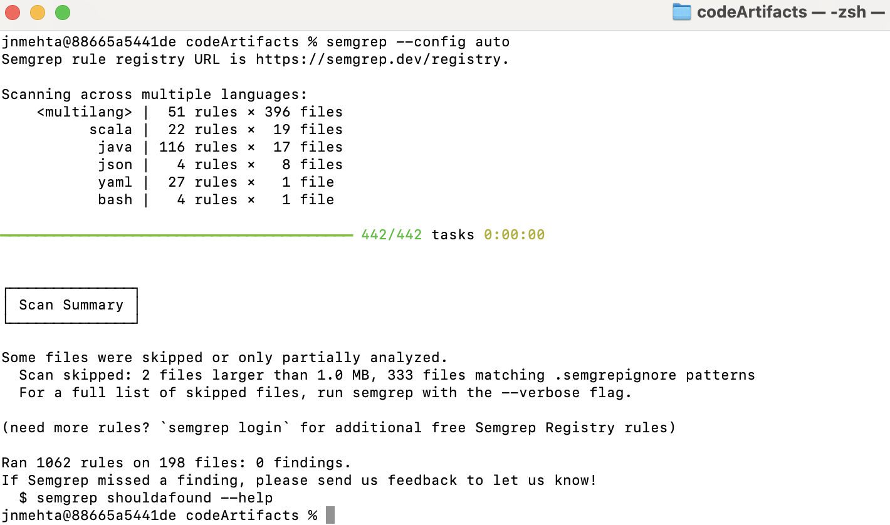

Welcome to the AWS CDA Connector - CDK Java project!
With this project you can easily deploy a state machine with step functions to create an EMR cluster, run a job, and terminate the cluster, using properties-parameterized Java CDK code. An EventBridge rule is also deployed, triggering the state machine execution based on cron.

<strong>Architecture diagram</strong>

<strong>Orchestration diagram with Audit and Controls report </strong>

<strong>Usage</strong>

cdk deploy -c environment=dev Prerequisites

After running the Prerequisites stack update the following paramaters in environments/dev/cdk.properties file

emr.subnet.id subnet id of the private subnet - the type of the resource is AWS::EC2::Subnet

sns.topic the Name of the SNS topic - the type of the resource is AWS::SNS::Topic

emr.logs.bucket.arn bucket id of the emr logs bucket - the type of the resource is AWS::S3::Bucket - and the default value for this should be emrlogs{AWS_ACCOUNT_ID}

The second main stack is also dependant on the existance of a key pair. This needs to be created manually and the Name must be added to the input file for property emr.ec2.key.name

cdk deploy -c environment=dev ScheduledEMR

After deployment of the main stack, go to EventBridge and enable the rule. Make sure the event schedule (displayed in cron format) is what you intended.

Useful commands

mvn package     compile and run tests

cdk ls          list all stacks in the app

cdk synth       emits the synthesized CloudFormation template

cdk deploy      deploy this stack to your default AWS account/region

cdk diff        compare deployed stack with current state

cdk docs        open CDK documentation

Enjoy!

<strong>Semgrep findings on OSR and CDAC code</strong>

